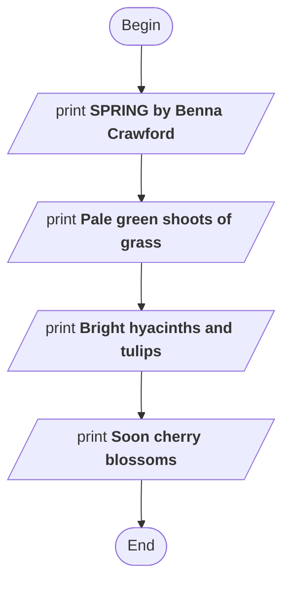
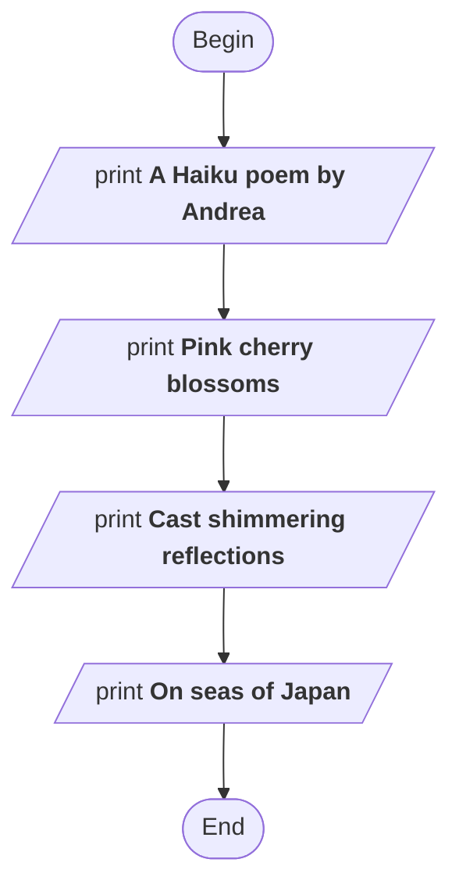
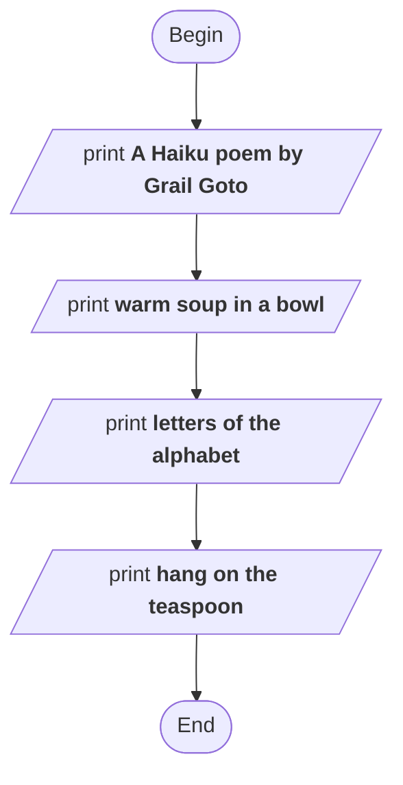

```python
print('SPRING by Benna Crawford')
print('Pale green shoots of grass')
print('Bright hyacinths and tulips')
print('Soon cherry blossoms')
```



Try converting these flow charts to Python code:

1.



2.



Can you find two examples of Haiku poetry (Or even write one yourself)? Draw the flow chart. Write the Python code. You can look for some examples from this site or search the internet yourself: https://www.weareteachers.com/haiku-poems-for-kids/
